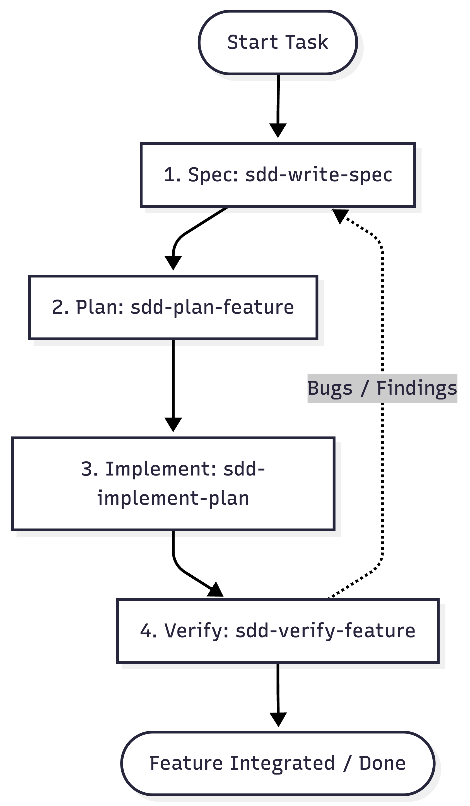
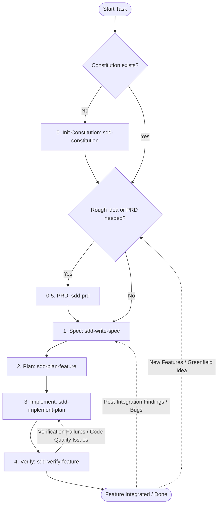

# sdd-harness

> SDD workflow orchestrator — thin layer that composes `agent-skills` and `superpowers` into end-to-end development workflows.

## What This Is

sdd-harness is a plugin that provides the **SDD (Spec-Driven Development) workflow** — a structured path from blank slate to shipped feature, with a built-in iteration loop for post-implementation findings:

```
constitution → prd → spec → plan → implement → verify-feature
                                               ↓
                                         findings → spec → plan → implement
```

It wraps skills from two major plugins -> `superpowers` and `agent-skills`

## Plugin Stack

```
sdd-harness (orchestrator)      — 9 SDD workflow skills
     ↓ delegates to
agent-skills (primitives)         — 24 engineering skills
superpowers (discipline)          — TDD, subagent-driven execution, brainstorming
frontend-design (UI/design)       — design direction, frontend quality
figma (design bridge)             — design → code bridge (read Figma designs into implementation context)
claude-md-management (tooling)    — CLAUDE.md audit and improvement
```

## Skills

| Skill | What It Does |
|-------|-------------|
| `/using-sdd-harness` | Routing tree — which skill for which task, across all plugins |
| `/sdd-constitution` | Create or extract SDD constitution — works for new and existing projects |
| `/sdd-prd` | Generate Product Requirements Document (PRD) from a rough idea via interactive discovery |
| `/sdd-write-spec` | Create feature spec for a new feature — updates project roadmap, generates feature spec, and drafts a human-facing flow diagram |
| `/sdd-plan-feature` | Plan a feature from a feature spec file — outputs plan.md/requirements.md/validation.md; triggers ADR for significant arch decisions |
| `/sdd-implement-plan` | Execute a feature plan — 3-way mode (subagent-driven / autonomous / checkpoint), domain-aware dispatch, TDD enforced, phase checkpoints, developer whole-branch review |
| `/sdd-implement-parallel-plans` | Execute multiple independent feature plans concurrently using isolated git worktrees |
| `/sdd-verify-feature` | Run parallel verification gate (test engineer & code quality reviewer), update progress files, run pre-merge audits, and integrate the branch |
| `/optimise-claude-md` | Audit and improve any project's CLAUDE.md |


## Installation

> **SSH blocked?** If your network blocks SSH connections to GitHub, run this once before installing:
> ```bash
> git config --global url."https://github.com/".insteadOf "git@github.com:"
> ```
> This rewrites any `git@github.com:` URLs to HTTPS automatically.

### Platform Integration Guides

#### 1. Claude Code

```bash
# Register marketplaces
claude plugin marketplace add https://github.com/addyosmani/agent-skills.git
claude plugin marketplace add https://github.com/isaackolamide/sdd-harness.git

# Install plugins
claude plugin install superpowers@claude-plugins-official
claude plugin install agent-skills@addy-agent-skills
claude plugin install figma@claude-plugins-official
claude plugin install claude-md-management@claude-plugins-official
claude plugin install sdd-harness@sdd-harness
```

#### 2. Antigravity CLI / IDE

```bash
agy plugin install https://github.com/addyosmani/agent-skills.git
agy plugin install https://github.com/obra/superpowers.git
agy plugin install https://github.com/isaackolamide/sdd-harness.git
```

#### 3. GitHub Copilot

```bash
copilot plugin install addyosmani/agent-skills
copilot plugin install obra/superpowers
copilot plugin install isaackolamide/sdd-harness
```

## How to Use

The SDD (Spec-Driven Development) workflow is structured into four main phases, executed in sequence.





> [!TIP]
> Unsure which skill to run for a specific task? Run `/using-sdd-harness` at the start of your session to view the authoritative routing tree across all plugins in the stack.

### Choose Your Entry Point

Pick the starting command that matches your current project state:

#### 1. Starting Fresh (New Project or Greenfield Initiative)
You do not have a project constitution yet. You need to bootstrap the core scope, guidelines, roadmap, or crystallize a rough idea.
```text

/sdd-constitution      # Interactive interview → generates mission.md, tech-stack.md, roadmap.md
/sdd-prd               # Discovery interview → generates sdd-specs/prds/YYYY-MM-DD-{feature}-prd.md
/sdd-write-spec        # Propose new feature spec (can read PRD) → features/YYYY-MM-DD-{feature}-spec.md
/sdd-plan-feature      # Choose feature/milestone → plan.md, requirements.md, validation.md
/sdd-implement-plan    # TDD slice-by-slice implementation loop
/sdd-implement-parallel-plans # Implement multiple independent plans concurrently
/sdd-verify-feature    # Formal validation, quality audits, ticks roadmap, merges branch
```
*Note: For an existing codebase, `/sdd-constitution` will automatically read your folder structure and commit history to pre-fill context before asking any questions.*

#### 2. Constitution Exists (Adding a New Feature)
The project constitution already exists. You are starting a new feature from the roadmap.
```text
/sdd-prd               # Discovery interview (optional) → generates PRD
/sdd-write-spec        # Creates feature spec (can consume PRD) → sdd-specs/features/YYYY-MM-DD-{feature}-spec.md
/sdd-plan-feature      # Reads feature spec → plan.md, requirements.md, validation.md
/sdd-implement-plan    # Runs implementation slices & developer review
/sdd-implement-parallel-plans # Implements multiple independent feature plans concurrently
/sdd-verify-feature    # Formally validates criteria & integrates branch
```

#### 3. Post-Implementation Findings (Bugs & Feedback)
Manual testing or review revealed issues or adjustments after running `/sdd-implement-plan`. Feed findings back into the spec/plan loop to handle them with discipline:
```text
/sdd-write-spec        # Generate spec from findings seed (inline or --file path/to/notes.md)
/sdd-plan-feature      # Plan the fixes → plan.md, requirements.md, validation.md
/sdd-implement-plan    # Implement fixes with TDD
/sdd-verify-feature    # Validate fixes and complete integration
```

---

### Command Deep Dive & Outputs

#### Phase 1: Discovery & Specification (`/sdd-constitution`, `/sdd-prd`, `/sdd-write-spec`)
Sets product requirements, project-wide boundaries, and creates feature specifications.
* **`/sdd-constitution` (No existing specs):**
  * `sdd-specs/mission.md` — Core objective, user persona, and "never do" list boundaries.
  * `sdd-specs/tech-stack.md` — Directory structure, code style rules (with code snippet), and test runner configurations.
  * `sdd-specs/roadmap.md` — Project milestones and release phases.
* **`/sdd-prd` (Rough product/feature idea):**
  * `sdd-specs/prds/YYYY-MM-DD-{name}-prd.md` — Comprehensive Product Requirements Document (PRD) detailing user journeys, MoSCoW priorities, and constraints. If a `figma.com` URL is present in the seed input, it is recorded verbatim under `## UI Design Reference`.
* **`/sdd-write-spec` (PRD or idea exists):**
  * `sdd-specs/features/YYYY-MM-DD-{name}-spec.md` — Scoped feature specification (can translate a PRD into a technical spec). Carries a `UI Design Reference` field if a Figma URL was supplied.
  * `sdd-specs/diagrams/YYYY-MM-DD-{name}-flow.md` — Optional Mermaid flow diagram for visual learners (requires user consent to save).
  * `sdd-specs/roadmap.md` — Appends the feature to the active roadmap phase.

#### Phase 2: `/sdd-plan-feature`
Breaks the feature spec into structured, implementable tasks.
* **Outputs:**
  * `sdd-specs/plans/YYYY-MM-DD-{name}/plan.md` — Task breakdown with strict interface contracts and phase checkpoints.
  * `sdd-specs/plans/YYYY-MM-DD-{name}/requirements.md` — Project scope, out-of-scope items, and design constraints (e.g. security, telemetry, migration risk). If the spec contained a `UI Design Reference` Figma URL, it is propagated verbatim into a `## UI Design Reference` section here.
  * `sdd-specs/plans/YYYY-MM-DD-{name}/validation.md` — Acceptance criteria checklist and definition of done.
  * `sdd-specs/docs/decisions/ADR-{NNN}.md` — Generated automatically if significant architectural choices surface.

#### Phase 3: `/sdd-implement-plan`
Executes the plan slice by slice using Test-Driven Development (TDD) on an isolated feature branch.
* **Execution Modes (selected on start):**
  * **Subagent-driven** (Recommended for $\ge$ 4 slices): Spawns an isolated subagent per task; maintains context cleanliness.
  * **Autonomous**: Executes the entire plan in a single run without pausing.
  * **Checkpoint**: Pauses for user confirmation after completing each slice.
* **Figma design context:** If `requirements.md` contains a `## UI Design Reference` Figma URL and a slice touches a screen or UI component, `figma:get_design_context` is called before building that slice's implementer brief (requires `figma:*` tools available in the session).
* **Branch isolation:** A new feature branch is always created at the start of execution — regardless of the current branch state.
* **Outputs:**
  * Commits corresponding to each task slice.
  * Phase checkpoints verified, ticked, and committed at phase boundaries.
  * Whole-branch code review results.

#### Phase 4: `/sdd-verify-feature`
Validates code compliance and merges the feature branch.
* **Workflow:**
  * Runs a **Parallel Verification Gate**: dispatches the `test-engineer` subagent to verify validation criteria and a `code-quality-reviewer` subagent to audit code quality simultaneously.
  * Audits raw execution logs and quality reports. Any issues found are added to `plan.md` under `## Validation Fixes` and `## Code Quality Review Fixes` to be resolved via `/sdd-implement-plan`.
  * Ticks off progress in `plan.md` and `roadmap.md` upon completion.
  * Runs a pre-merge programmatic verification gate (checks git cleanliness, runs main build, lint, and test scripts).
  * Integrates the branch and cleans up using `superpowers:finishing-a-development-branch`.

## What's NOT in This Plugin

Skills that used to be copied here now live in `agent-skills` directly:

- interview-me, idea-refine
- incremental-implementation, api-and-interface-design
- code-review-and-quality, security-and-hardening
- ci-cd-and-automation, observability-and-instrumentation
- documentation-and-adrs, deprecation-and-migration

Install `agent-skills@addy-agent-skills` to get all of these.
