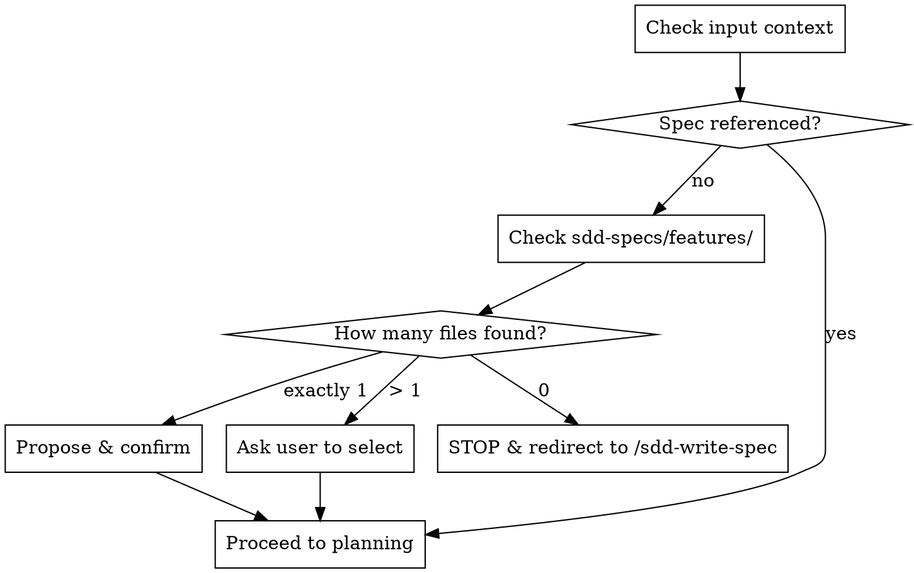
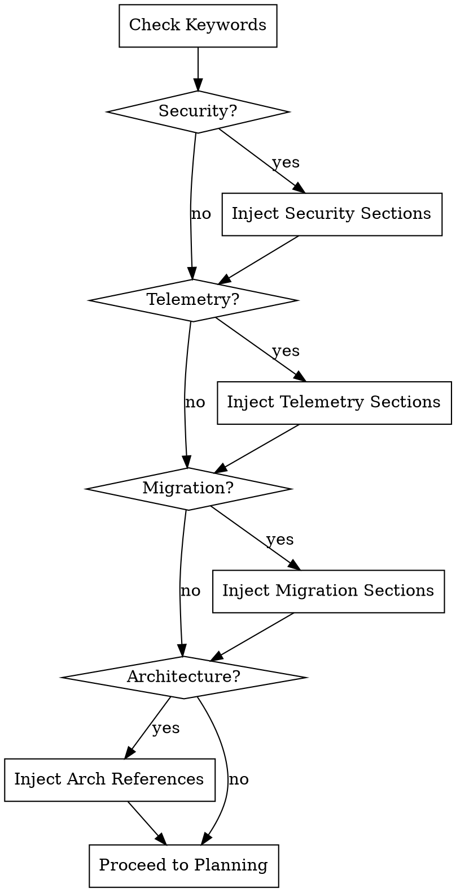

# SDD Feature Planner

## When to Use
- **Use when** a feature spec exists in `sdd-specs/features/` and you need to plan it.
- **Do NOT use when** no feature spec exists (use `/sdd-write-spec`).
- **Do NOT use when** executing a plan (use `/sdd-implement-plan`).

## Workflow

### 0. Feature Spec Verification

1. If no spec is provided, check `sdd-specs/features/`.
2. Multiple files? Ask user to select.
3. Exactly one? Propose and confirm.
4. None? **STOP**. Direct user to `/sdd-write-spec`.
5. Parse the spec for: Objective (Why/Outcome), User (Who), Acceptance Criteria (Success), Technical Constraints (Constraint), Dependencies. 
6. Carry any `figma.com` UI Design References verbatim into `requirements.md`.

### 1. Gather Project Context
Read `sdd-specs/mission.md`, `tech-stack.md`, and `roadmap.md`. Note missing files but do not block.

### 2. Minimum Viable Fields Check
Assess 5 core fields: Who, Why/Outcome, Success, Constraint, Dependencies.
- Propose finalized intent restatement to user.
- **Wait for explicit confirmation.**
- If fields are missing: **REQUIRED SUB-SKILL:** Use `agent-skills:interview-me`.

### 3. Feature Naming & Classification
1. Propose `sdd-specs/plans/YYYY-MM-DD-{feature-name}/` and ask single confirmation question.
2. Check spec against conditional triggers:

   - **Security** (`auth`, `login`, `payment`): **REQUIRED SUB-SKILL:** `agent-skills:security-and-hardening` (inject Security Constraints).
   - **Telemetry** (`API`, `cron`, `metric`): **REQUIRED SUB-SKILL:** `agent-skills:observability-and-instrumentation` (inject Telemetry sections).
   - **Migration** (`refactor`, `schema`): **REQUIRED SUB-SKILL:** `agent-skills:deprecation-and-migration` (inject Migration Plan).
   - **Architecture** (`controller`, `dto`): Add `clean-architecture-ddd-reference.md` to references.
   - Always include `testing-patterns.md` in references.

### 4. Planning & Decomposition
**REQUIRED SUB-SKILL:** Use `agent-skills:planning-and-task-breakdown`.
- **Confirm order and sizing** with user before formatting.
- **Format directly into `plan.md`** (use `templates/plan.md`). No intermediate files.
- **Constraints**: 
  - Each task needs `Interfaces` (function signature + strict types). NO `any`/`unknown`.
  - Task headers: `### Task X.Y: [Name]`
  - End phases with `### Checkpoint — Phase N` with a checkbox.
  - Inject `targetBaseBranch: <current-branch>` in YAML frontmatter.
- **ADR Trigger**: For significant architectural choices, **REQUIRED SUB-SKILL:** `agent-skills:documentation-and-adrs` → save to `sdd-specs/docs/decisions/` and cross-reference.

### 5. Pre-Write Review (GATE)
Present summary of `plan.md`, `requirements.md`, and `validation.md`.
**Ask focused probe:** "Anything in the plan surprise you, missing from scope, or acceptance criterion feels wrong?"
- Adjust and re-confirm if concerns raised.
- **STOP**: Wait for explicit "yes" before writing files.

### 6. Output
Write `plan.md`, `requirements.md`, and `validation.md` to `sdd-specs/plans/YYYY-MM-DD-{feature-name}/`. (Refer to `templates/`).

## Anti-Rationalization

| Excuse | Reality |
|--------|---------|
| "I'll batch confirmations at the end." | Batching bypasses user guidance. Stop at each gate. |
| "I don't need to ask for feature name." | Dictates future tooling. Confirm the name. |
| "I'll assume missing fields." | Guessing builds the wrong feature. Use interview-me. |
| "I'll skip the pre-write review." | Causes churn if plan is wrong. Final safety net. |

## Red Flags - STOP
- Combining Steps 2, 3, and 4 into a single prompt.
- Proceeding past Step 5 without explicit affirmative response.
- Skipping `**REQUIRED SUB-SKILL**` invocations.
- Using absolute file paths (use `sdd-specs/...` paths).
- Outputting code instead of strict interface contracts.
