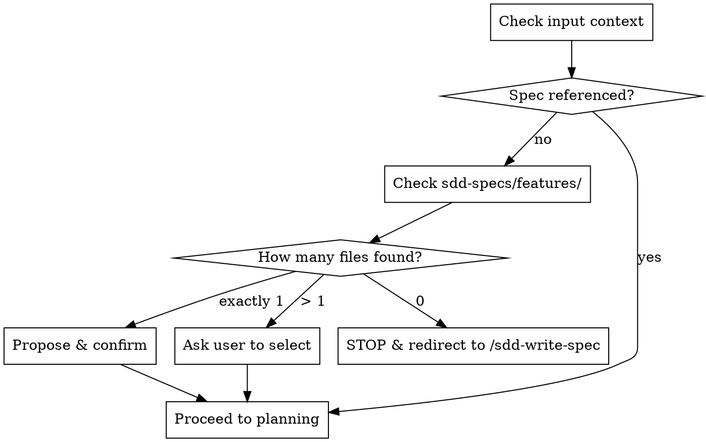
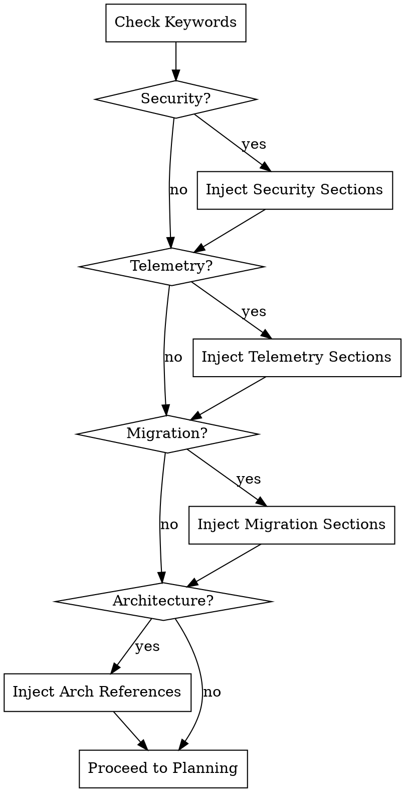

# SDD Feature Planner

**REQUIRED SUB-SKILL:** Use `agent-skills:planning-and-task-breakdown` to structure the implementation plan.
**REQUIRED SUB-SKILL:** Use `agent-skills:security-and-hardening` if the feature involves security.
**REQUIRED SUB-SKILL:** Use `agent-skills:observability-and-instrumentation` if the feature involves telemetry.
**REQUIRED SUB-SKILL:** Use `agent-skills:deprecation-and-migration` if the feature involves migrations.
**REQUIRED SUB-SKILL:** Use `agent-skills:documentation-and-adrs` if the feature requires an ADR.

## When to Use
- **Use when** a feature spec exists in `sdd-specs/features/` and you need to plan it.
- **Do NOT use when** no feature spec exists (use `/sdd-write-spec`).
- **Do NOT use when** executing a plan (use `/sdd-implement-plan`).

## Workflow

### Step 1: Feature Spec Verification

1. If no spec is provided, check `sdd-specs/features/`.
2. Multiple files? Ask user to select.
3. Exactly one? Propose and confirm.
4. None? **STOP**. Direct user to `/sdd-write-spec`.
5. Parse the spec for: Objective (Why/Outcome), User (Who), Acceptance Criteria (Success), Technical Constraints (Constraint), Dependencies. 
6. Carry any `figma.com` UI Design References verbatim into `requirements.md`.

### Step 2: Gather Project Context
1. Read `sdd-specs/mission.md`, `tech-stack.md`, and `roadmap.md`. 
2. Note missing files but do not block.

### Step 3: Feature Naming & Classification
1. Propose `sdd-specs/plans/YYYY-MM-DD-{feature-name}/` and ask single confirmation question.
2. Check spec against conditional triggers:

3. Apply required sub-skills based on triggers:
   - **Security** (`auth`, `login`, `payment`): invoke `agent-skills:security-and-hardening` (inject Security Constraints).
   - **Telemetry** (`API`, `cron`, `metric`): invoke `agent-skills:observability-and-instrumentation` (inject Telemetry sections).
   - **Migration** (`refactor`, `schema`): invoke `agent-skills:deprecation-and-migration` (inject Migration Plan).
4. Gather references:
   - **Architecture** (`controller`, `dto`): Add `clean-architecture-ddd-reference.md` to references.
   - Always include `testing-patterns.md` in references.

### Step 4: Planning & Decomposition
1. Invoke `agent-skills:planning-and-task-breakdown`.
2. Confirm order and sizing with user before formatting.
3. Format directly into `plan.md` (MUST follow structure of `skills/sdd-plan-feature/templates/plan.md`). No intermediate files.
4. Apply the following constraints to `plan.md`:
   - Each task needs `Interfaces` (function signature + strict types). NO `any`/`unknown`.
   - Task headers: `### Task X.Y: [Name]`
   - End phases with `### Checkpoint — Phase N` with a checkbox.
   - Inject `feature`, `specFile`, `targetBaseBranch: <current-branch>`, and `created: YYYY-MM-DD` in YAML frontmatter.
5. Apply ADR Trigger: For significant architectural choices, invoke `agent-skills:documentation-and-adrs` to save a decision record to `sdd-specs/docs/decisions/` and cross-reference it.

### Step 5: Pre-Write Review (GATE)
1. Present summary of `plan.md`, `requirements.md`, and `validation.md`.
2. Ask focused probe: "Does anything in the plan surprise you, or does any acceptance criterion feel wrong? If it looks correct, please confirm we are ready to write the files."
3. Adjust and re-confirm if concerns raised.
4. **STOP**: Wait for explicit approval before writing files.

### Step 6: Output

1. **REQUIRED ACTION:** You MUST use your file reading tools to read the template files before generating the output. Your output MUST exactly match the headings, sections, and structure of these templates.
2. Read the templates located in the `skills/sdd-plan-feature/templates/` directory to format the generated planning files:
   - **plan.md**: [templates/plan.md](templates/plan.md)
   - **requirements.md**: [templates/requirements.md](templates/requirements.md)
   - **validation.md**: [templates/validation.md](templates/validation.md)
3. Write `plan.md`, `requirements.md`, and `validation.md` to `sdd-specs/plans/YYYY-MM-DD-{feature-name}/` using the exact structure of the templates you just read.

## Common Rationalizations & Red Flags

| Excuse / Red Flag | Reality |
|--------|---------|
| "I'll batch confirmations at the end." | Batching bypasses user guidance. Stop at each gate. |
| "I don't need to ask for feature name." | Dictates future tooling. Confirm the name. |
| "I'll skip the pre-write review." | Causes churn if plan is wrong. Final safety net. |
| "I know how to write a plan." | Templates define mandatory SDD structural contracts. Read and follow them exactly. |
| "I'll just add prose notes instead of the checklist." | Structural templates are mandatory. Do not negotiate the format or omit sections. |

## Red Flags - STOP and Correct
- Combining Step 3 (Classification) and Step 4 (Planning) into a single prompt.
- Proceeding past Step 5 without explicit affirmative response.
- Skipping `**REQUIRED SUB-SKILL**` invocations.
- Generating output files without reading the templates first.
- Modifying the template structure or omitting required sections/checklists.
- Using absolute file paths (use `sdd-specs/...` paths).
- Outputting code instead of strict interface contracts.
