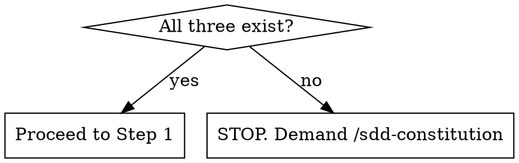

# Spec-Driven Development (SDD) Feature Spec Generator

Generate a scoped feature specification (`sdd-specs/features/YYYY-MM-DD-<feature-name>-spec.md`) and update the project roadmap. 

**REQUIRED SUB-SKILL:** Use `agent-skills:interview-me` to extract the user's distilled intent.
**REQUIRED SUB-SKILL:** Use `superpowers:brainstorming` to design the feature.

## Workflow

### Step 0: Constitution Check

**Before anything else**, check whether all three constitution files exist:

```
sdd-specs/mission.md
sdd-specs/tech-stack.md
sdd-specs/roadmap.md
```



- **All three exist** → Proceed to Step 1.
- **Partial or None exist** → **STOPS**. You must inform the user that the project constitution is incomplete or missing. Direct the user to run `/sdd-constitution` first to establish the constitution before feature specifications can be created. Do not proceed to brainstorming or feature spec generation.

---

## Feature Spec Generation

### Step 1: Intent Discovery & Distillation

1. Read `sdd-specs/mission.md`, `sdd-specs/tech-stack.md`, and `sdd-specs/roadmap.md`.
2. Parse any provided seed input (whether a PRD, a raw prompt, or nothing).
3. Unconditionally invoke `agent-skills:interview-me` interactively in the chat (one question at a time) to fill gaps in the seed input and extract the user's distilled intent. Do not guess or hallucinate requirements.

### Step 2: Constitution Alignment Check

1. **Map Intent**: Map the confirmed distilled intent against the existing constitution. **This is a STOP step** — resolve "Never Do" conflicts before proceeding.
2. **Check `mission.md`**:
   - **"Never Do" violations** — hard blockers. Name them explicitly. **The agent MUST refuse to proceed or write any spec files if a "Never Do" violation is active. Stop and explain that the user must modify `sdd-specs/mission.md` first to remove the constraint before you can continue.**
   - **"Ask First" items** — flag items needing stakeholder approval. Do not block, but surface them as explicit flags in the output.
3. **Check `roadmap.md`**: Identify which existing phase this feature belongs to, or whether it opens a new one.

### Step 3: Design Brainstorming (via Subagent)

1. **Dispatch Brainstorming**: Unconditionally dispatch a subagent to invoke `superpowers:brainstorming`.
2. **Seed Prompt**: Pass the distilled intent (from Step 1), the seed input (e.g., the PRD, which should be relatively small), and the Constitution constraints (from Step 2) directly into the subagent's prompt so it has full context.
3. **Output Override**: Instruct the subagent explicitly: *"Your ONLY authorized action is to return the finalized, user-approved design markdown directly to me in your final response. You must not save files or invoke writing-plans."*

### Step 4: Update Roadmap & Create Feature Spec

1. Create `sdd-specs/features/YYYY-MM-DD-<feature-name>-spec.md` using the raw outputs and the provided template.
   - Inject outputs into `templates/feature-spec.md` exactly as follows:
     - **Template Slots**: Fill directly with `interview-me` outputs.
     - **Architecture Section**: Insert the `brainstorming` output HERE, but you MUST exclude its top-level markdown title (`# ...`) and metadata block (Date, Status, Author) since the template already has a header.
2. Edit `sdd-specs/roadmap.md` — add the feature as a new milestone, sub-item, or phase entry under the appropriate existing phase, linking to the newly created spec file.

### Step 5: Generate Human-Facing Flow Diagram

1. Draft a companion Mermaid flow diagram for the feature based on the completed spec. **Crucial**: Since this is meant to help human visual learners, it MUST be highly descriptive. Include a brief, simple step-by-step text explanation above the diagram, and use Mermaid annotations (e.g., descriptive node labels, `note` blocks) to clearly explain the flow.

**No exceptions:**
- Don't skip drafting the diagram because the feature is "simple"
- Don't assume the user wants to skip it
- You MUST output the drafted diagram in your chat response first

2. **Seek Consent Before Saving**: Present the drafted explanation and Mermaid diagram in your chat response and explicitly ask the user: *"Would you like me to save this flow diagram to `sdd-specs/diagrams/YYYY-MM-DD-<feature-name>-flow.md`?"*
3. **STOP AND WAIT** for the user's consent. Do not write the diagram to disk until the user explicitly approves. Do not hand off to the next skill yet.
4. **Context Isolation Rule**: If approved and saved, this diagram is strictly for human consumption. You MUST save it as a separate file and NEVER inject it into the main feature spec or ADRs, as it unnecessarily bloats agent context windows.

Once you have drafted the diagram, asked for consent, AND received the user's explicit response (whether they approve or decline), hand off the feature spec:
`/sdd-plan-feature sdd-specs/features/YYYY-MM-DD-<feature-name>-spec.md`

**Output:**
```
sdd-specs/
├── roadmap.md                                      ← updated
├── diagrams/
│   └── YYYY-MM-DD-<feature-name>-flow.md           ← created (if consented)
└── features/
    └── YYYY-MM-DD-<feature-name>-spec.md           ← created
```

---

## Common Mistakes

- **Creating feature roadmaps:** Don't create `sdd-specs/features/roadmap.md`. Append to the project `sdd-specs/roadmap.md`.
- **Absolute paths:** Never use absolute paths (`file:///Users/...`) in outputs. Use paths relative to the project root (e.g., `sdd-specs/features/...`).

## Rationalization Table

| Excuse | Reality |
|--------|---------|
| "PRD is complete, no interview needed." | PRDs contain assumptions. Interview extracts distilled intent. |
| "User commanded me to skip subagents." | User commands don't override SDD workflows. |
| "I'll ask all questions at once." | `interview-me` requires one-by-one to work. |
| "Constitution check failed, I'll write it anyway." | Writing without constitution guarantees violations. Stop. |
| "Diagram belongs in the main spec." | Diagrams bloat context. Keep isolated in `sdd-specs/diagrams/`. |
| "Feature is simple, I'll skip the diagram draft." | You must draft it. Only the user can skip saving it. |
| "I'll save the diagram without asking." | Must seek explicit consent to keep workspace clean. |

## Red Flags - STOP and Start Over

- "I don't need `mission.md` for this simple spec."
- "The 'Never Do' violation is minor."
- "I'll invent acceptance criteria to be helpful."
- "The user explicitly told me to skip brainstorming."
- "I injected the flow diagram into the spec."
- "I saved the diagram without consent."
- "I skipped drafting a diagram because the feature is simple."
- "I generated a bare-bones diagram without text explanations."

**All of these mean: Stop. Follow the hard stops.**
