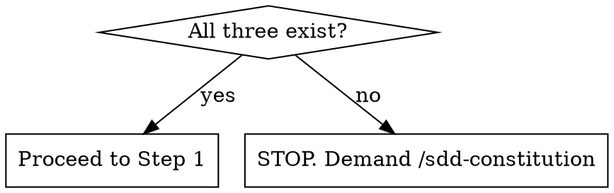

# Spec-Driven Development (SDD) Feature Spec Generator

Generate a scoped feature specification (`sdd-specs/features/YYYY-MM-DD-<feature-name>-spec.md`) and update the project roadmap. 

**REQUIRED SUB-SKILL:** Use `agent-skills:interview-me` to extract the user's distilled intent.
**REQUIRED SUB-SKILL:** Use `superpowers:brainstorming` to design the feature.

## Workflow

### Step 0: Constitution Check

**Before anything else**, check whether all three constitution files exist:

```
sdd-specs/mission.md
sdd-specs/tech-stack.md
sdd-specs/roadmap.md
```



- **All three exist** → Proceed to Step 1.
- **Partial or None exist** → **STOPS**. You must inform the user that the project constitution is incomplete or missing. Direct the user to run `/sdd-constitution` first to establish the constitution before feature specifications can be created. Do not proceed to brainstorming or feature spec generation.

---

## Feature Spec Generation

### Step 1: Intent Discovery & Distillation

1. Read `sdd-specs/mission.md`, `sdd-specs/tech-stack.md`, and `sdd-specs/roadmap.md`.
2. Parse any provided seed input (whether a PRD, a raw prompt, or nothing).
3. Unconditionally invoke `agent-skills:interview-me` interactively in the chat (one question at a time) to fill gaps in the seed input and extract the user's distilled intent. Do not guess or hallucinate requirements.

### Step 2: Constitution Alignment Check

1. **Map Intent**: Map the confirmed distilled intent against the existing constitution. **This is a STOP step** — resolve "Never Do" conflicts before proceeding.
2. **Check `mission.md`**:
   - **"Never Do" violations** — hard blockers. Name them explicitly. **The agent MUST refuse to proceed or write any spec files if a "Never Do" violation is active. Stop and explain that the user must modify `sdd-specs/mission.md` first to remove the constraint before you can continue.**
   - **"Ask First" items** — flag items needing stakeholder approval. Do not block, but surface them as explicit flags in the output.
3. **Check `roadmap.md`**: Identify which existing phase this feature belongs to, or whether it opens a new one.

### Step 3: Design Brainstorming (via Subagent)

1. **Dispatch Brainstorming**: Unconditionally dispatch a brainstorming subagent to invoke `superpowers:brainstorming`.
2. **Seed Prompt**: You MUST use the following exact structured prompt when dispatching the brainstorming subagent. Inject the required context into the designated slots. This airtight contract overrides the brainstorming skill's default instruction to save files:

   ```text
   **Your Mission:** Use `superpowers:brainstorming` to design the feature alongside the user. 

   **Distilled Intent & Seed Input:** 
   [Inject Intent and PRD from Step 1]

   **Constitution Constraints:**
   [Inject Constraints from Step 2]

   **REQUIRED OUTPUT CONTRACT (CRITICAL):**
   Your ONLY authorized action is to return the finalized, user-approved design markdown directly to me in your final response. 

   No exceptions:
   - DO NOT save any files to disk (e.g., to superpowers/specs/ or anywhere else).
   - DO NOT invoke writing-plans or any planning skills.
   - If the brainstorming skill tells you to save a file, ignore it. Return the text directly to me instead.
   ```

### Step 4: Update Roadmap & Create Feature Spec

1. Create `sdd-specs/features/YYYY-MM-DD-<feature-name>-spec.md` using the raw outputs and the provided template.
   - Inject outputs into `templates/feature-spec.md` exactly as follows:
     - **Template Slots**: Fill directly with `interview-me` outputs.
     - **Architecture Section**: Insert the `brainstorming` output HERE, but you MUST exclude its top-level markdown title (`# ...`) and metadata block (Date, Status, Author) since the template already has a header.
2. Edit `sdd-specs/roadmap.md` — add the feature as a new milestone, sub-item, or phase entry under the appropriate existing phase, linking to the newly created spec file.

### Step 5: Delegate Flow Diagram Generation

To keep your context clean while ensuring the workflow completes predictably, you MUST delegate the diagram creation to a flow diagram subagent and wait for it to confirm completion.

1. **Dispatch Diagram Subagent**: Unconditionally dispatch a background flow diagram subagent with the following explicit `Task` instruction:

   ```text
   **Your Mission**: Read the feature spec at `sdd-specs/features/YYYY-MM-DD-<feature-name>-spec.md`.
   Draft a companion Mermaid flow diagram for it. Since this is for human visual learners, it MUST be highly descriptive. Include a brief step-by-step text explanation above the diagram, and use Mermaid annotations (e.g., descriptive node labels, `note` blocks).
   Save the final diagram to `sdd-specs/diagrams/YYYY-MM-DD-<feature-name>-flow.md`.
   Return a confirmation message when the file is successfully saved.
   ```

2. **Wait and Confirm**: Wait for the flow diagram subagent to finish and return its confirmation. Present a brief summary to the user confirming that the diagram has been saved to the workspace.

3. **Handoff**: After confirming the diagram is saved, hand off the feature spec to the planning phase:
`/sdd-plan-feature sdd-specs/features/YYYY-MM-DD-<feature-name>-spec.md`

**Context Isolation Rule**: This diagram is strictly for human consumption. It MUST remain in the `diagrams/` folder and NEVER be injected into the main feature spec or ADRs, as it unnecessarily bloats agent context windows.

**Output:**
```
sdd-specs/
├── roadmap.md                                      ← updated
├── diagrams/
│   └── YYYY-MM-DD-<feature-name>-flow.md           ← created (by subagent)
└── features/
    └── YYYY-MM-DD-<feature-name>-spec.md           ← created
```

---

## Common Mistakes

- **Creating feature roadmaps:** Don't create `sdd-specs/features/roadmap.md`. Append to the project `sdd-specs/roadmap.md`.
- **Absolute paths:** Never use absolute paths (`file:///Users/...`) in outputs. Use paths relative to the project root (e.g., `sdd-specs/features/...`).
- **Delegating roadmap check-offs:** Do not include checking off `roadmap.md` in the feature spec's "In Scope" or tasks. The `sdd-verify-feature` skill handles roadmap check-offs. The spec should only contain feature logic.

## Rationalization Table

| Excuse | Reality |
|--------|---------|
| "PRD is complete, no interview needed." | PRDs contain assumptions. Interview extracts distilled intent. |
| "User commanded me to skip subagents." | User commands don't override SDD workflows. |
| "I'll ask all questions at once." | `interview-me` requires one-by-one to work. |
| "Constitution check failed, I'll write it anyway." | Writing without constitution guarantees violations. Stop. |
| "Diagram belongs in the main spec." | Diagrams bloat context. Keep isolated in `sdd-specs/diagrams/`. |
| "Feature is simple, I'll skip the flow diagram." | You must dispatch the flow diagram subagent to build it. |
| "I'll hand off to planning before the flow diagram subagent finishes." | You must wait for the flow diagram subagent to confirm the diagram is saved first. |
| "The brainstorming skill told me to save to specs/" | The task override explicitly forbids saving files to disk. Return text only. |
| "I should tell the implementer to check off the roadmap in the spec." | `sdd-verify-feature` handles roadmap check-offs. The spec must not include SDD process steps. |

## Red Flags - STOP and Start Over

- "I don't need `mission.md` for this simple spec."
- "The 'Never Do' violation is minor."
- "I'll invent acceptance criteria to be helpful."
- "The user explicitly told me to skip brainstorming."
- "I injected the flow diagram into the spec."
- "I handed off to `/sdd-plan-feature` before the flow diagram subagent finished."
- "I skipped the flow diagram subagent because the feature is simple."
- "I generated the flow diagram myself instead of using the flow diagram subagent."
- "The brainstorming subagent saved a design file to disk."
- "I added roadmap check-off tasks to the feature spec's In Scope section."

**All of these mean: Stop. Follow the hard stops.**
