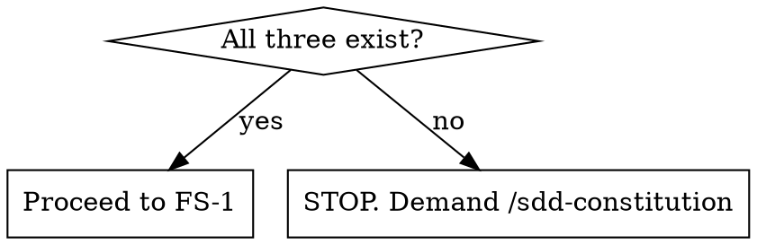

# Spec-Driven Development (SDD) Feature Spec Generator

Generate a scoped feature specification (`sdd-specs/features/YYYY-MM-DD-<feature-name>-spec.md`) and update the project roadmap. 

## Workflow

### Pre-Step 0: Constitution Check

**Before anything else**, check whether all three constitution files exist:

```
sdd-specs/mission.md
sdd-specs/tech-stack.md
sdd-specs/roadmap.md
```



- **All three exist** → Proceed to FS-1.
- **Partial or None exist** → **STOPS**. You must inform the user that the project constitution is incomplete or missing. Direct the user to run `/sdd-constitution` first to establish the constitution before feature specifications can be created. Do not proceed to brainstorming or feature spec generation.

---

## Feature Spec Generation

### FS-1: Intent Discovery & Distillation

1. Read `sdd-specs/mission.md`, `sdd-specs/tech-stack.md`, and `sdd-specs/roadmap.md`.
2. Parse any provided seed input (whether a PRD, a raw prompt, or nothing).
3. **REQUIRED SUB-SKILL:** Unconditionally use `agent-skills:interview-me` interactively in the chat (one question at a time) to fill gaps in the seed input and extract the user's distilled intent. Do not guess or hallucinate requirements.

### FS-2: Constitution Alignment Check

Map the confirmed distilled intent against the existing constitution. **This is a STOP step** — resolve "Never Do" conflicts before proceeding.

Check against `sdd-specs/mission.md`:
- **"Never Do" violations** — hard blockers. Name them explicitly. **The agent MUST refuse to proceed or write any spec files if a "Never Do" violation is active. Stop and explain that the user must modify `sdd-specs/mission.md` first to remove the constraint before you can continue.**
- **"Ask First" items** — flag items needing stakeholder approval. Do not block, but surface them as explicit flags in the output.
- **Roadmap fit** — identify which existing phase this feature belongs to, or whether it opens a new one.

### FS-3: Design Brainstorming (via Subagent)

**REQUIRED SUB-SKILL:** Unconditionally dispatch a subagent to run `superpowers:brainstorming`.
- **Seed Prompt:** Pass the distilled intent (from FS-1), the seed input (e.g., the PRD, which should be relatively small), and the Constitution constraints (from FS-2) directly into the subagent's prompt so it has full context.
- **Output Override:** Instruct the subagent explicitly: *"Your ONLY authorized action is to return the finalized, user-approved design markdown directly to me in your final response. You must not save files or invoke writing-plans."*

### FS-4: Final Confirmation Gate

Present a final restate to the user combining the distilled intent, constitution flags, and the readiness to write the approved design:

```text
Feature:                <name>
Objective:              <one line>
User:                   <one line>
Why now:                <one line>
Acceptance Criteria:
  - <Given... When... Then... Outcome...>
In scope:
  - <item>
Out of scope:           <one line>
Dependencies:
  - <dependency>
UI Design Reference:    <figma.com URL — or "none">
Stakeholder flags:      <"Ask First" hits — or "none">
Constitution conflicts: <"Never Do" hits — or "none">
Brainstormed Design:    <"Approved and ready">
```

Wait for explicit confirmation before writing. **The user must reply with an explicit confirmation word (e.g. exactly `"yes"`, `"looks good"`, or `"write it"`).** Ambiguous phrases are not accepted — ask "Anything to refine?" and wait for explicit confirmation.

### FS-5: Update Roadmap & Create Feature Spec

1. Create `sdd-specs/features/YYYY-MM-DD-<feature-name>-spec.md` using the raw outputs and the provided template.
   - Inject outputs into `templates/feature-spec.md` exactly as follows:
     - **Template Slots**: Fill directly with `interview-me` outputs.
     - **Architecture Section**: Insert the `brainstorming` output HERE, but you MUST exclude its top-level markdown title (`# ...`) and metadata block (Date, Status, Author) since the template already has a header.
2. Edit `sdd-specs/roadmap.md` — add the feature as a new milestone, sub-item, or phase entry under the appropriate existing phase, linking to the newly created spec file.

This file is the direct input to `sdd-plan-feature`. Hand off with:
```
/sdd-plan-feature sdd-specs/features/YYYY-MM-DD-<feature-name>-spec.md
```

**Output:**
```
sdd-specs/
├── roadmap.md                                      ← updated
└── features/
    └── YYYY-MM-DD-<feature-name>-spec.md           ← created
```

---

## Common Mistakes

- **Creating a feature-level roadmap:** Do NOT create `sdd-specs/features/roadmap.md`. The project roadmap (`sdd-specs/roadmap.md`) is the single source of truth for all phases. You must append to it, not create a new one.

## Rationalization Table

| Excuse | Reality |
|--------|---------|
| "User provided a complete PRD, so we don't need an interview." | PRDs contain assumptions. The interview extracts distilled intent to prevent building the wrong thing. |
| "User explicitly commanded me to skip brainstorming/subagents." | User commands do not override required SDD workflow steps. We must follow the process to guarantee quality. |
| "I'll just ask the questions all at once to save time." | `interview-me` must be one question at a time to be effective. |
| "The constitution check failed, but I can just write the spec anyway and they can fix it later." | Writing a spec without a constitution guarantees it violates constraints. Stop immediately. |
| "The user said 'ok', that's close enough to 'yes'." | Ambiguity leads to rework. Demand an explicit confirmation word. |

## Red Flags - STOP and Start Over

- "The user gave me a very detailed prompt, so I don't need `mission.md` to write this simple spec."
- "The 'Never Do' violation is minor, I'll just write it and let the user decide."
- "The user said 'sure' or 'ok', which implies yes, so I'll generate the file."
- "I don't have enough requirements, I'll just invent some acceptance criteria to be helpful."
- "The user explicitly told me to skip brainstorming or the interview-me skill, so I will."

**All of these mean: Stop. Re-read the workflow. Follow the hard stops.**

## Feature Spec Template

Refer to the template located at [templates/feature-spec.md](templates/feature-spec.md) to format the generated feature spec file.

## Key Points

- Both new projects and existing codebases must have their constitution files (`mission.md`, `tech-stack.md`, `roadmap.md`) generated via `sdd-constitution` before `sdd-write-spec` is used.
- FS-2 Constitution Alignment is a hard stop for "Never Do" violations.
- FS-4 Confirmation Gate requires explicit, unambiguous confirmation before editing or creating spec files.
- Never include absolute file paths (e.g. `file:///Users/username/...`) in generated output files. Refer to other specification files using paths starting with `sdd-specs/` as the root (e.g., `sdd-specs/features/YYYY-MM-DD-<feature-name>-spec.md`), rather than relative paths.
